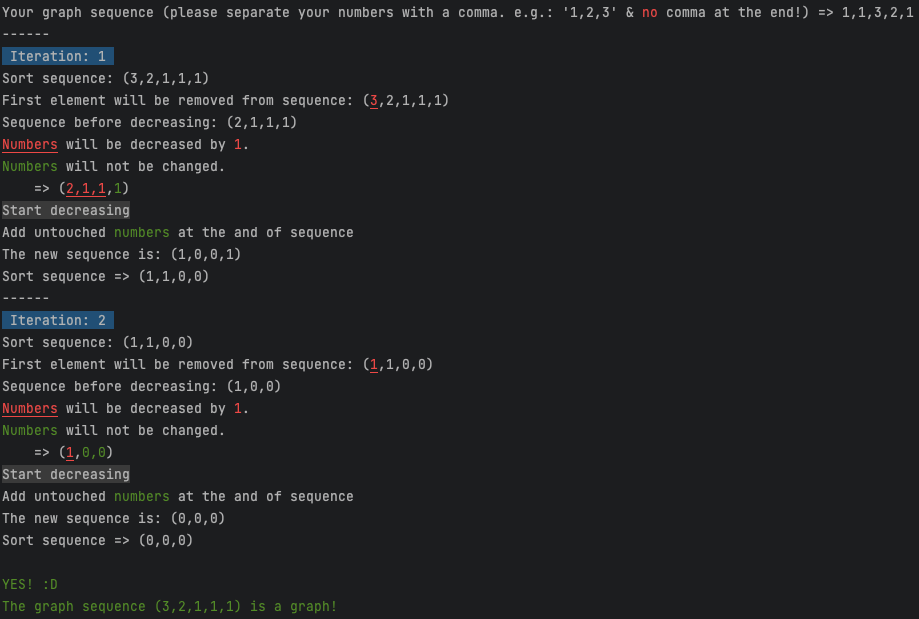

# Graph_Sequence_Checker
With this small program you can check if a graph sequence is a graph or not.

## Getting Started

This Project is written in Typescript.

You can run the project in Stackblitz or run it locally:

**Stackblitz**

- open => [Stackblitz](https://stackblitz.com/github/TeePlunder/Graph_Sequence_Checker) 

**Locally**

If you want to run the project locally at your place, you need:

- [Node](https://nodejs.org/en/download/)
- your favorit package manager (e.g. [NPM](https://www.npmjs.com/), [YARN](https://yarnpkg.com/), [PNPM](https://pnpm.io/))

That's all :)

## Usage

1. open the console in project
2. run ```npm install``` | ```yarn install``` | ```pnpm install``` to install all dependencies
3. to start run => ```npm run start``` | ```yarn start``` | ```pnpm start```

The program will look like this:



**Have fun! :D**
